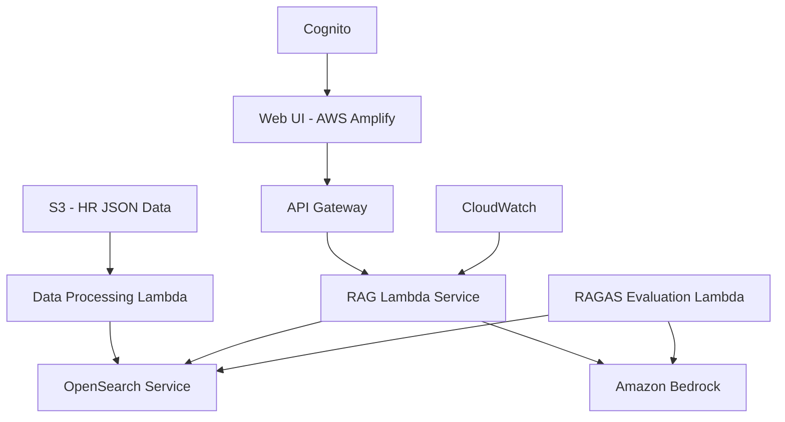

# HR RAG POC Implementation

A proof of concept for HR domain RAG system using AWS, LangChain, and Bedrock.

## Project Overview

This POC implements a Retrieval-Augmented Generation (RAG) system focused on the HR domain, providing a foundation for future development and scalability.

### Key Features

- RAG system powered by AWS services
- Hybrid search using AWS OpenSearch
- One-time indexing from JSON files in S3 bucket
- Web UI with simple access control
- Question/answer evaluation using RAGAS

### Architecture



## Components

### Data Management
- AWS S3 for HR profile JSON data storage
- AWS Lambda for data processing and indexing
- Amazon OpenSearch Service with hybrid search capabilities

### RAG Implementation
- LangChain Framework for the RAG pipeline
- Amazon Bedrock for LLM operations
- Hybrid retrieval using OpenSearch

### Web Interface
- AWS Amplify hosted frontend
- Amazon Cognito for authentication
- API Gateway for REST endpoints

### Monitoring & Evaluation
- CloudWatch for metrics tracking
- RAGAS Framework for evaluation
- Lambda Function for evaluation execution

## Project Structure

```
/
├── docs/              # Documentation
├── infrastructure/    # AWS infrastructure code
├── src/
│   ├── data/         # Data processing scripts
│   ├── rag/          # RAG implementation
│   ├── api/          # API endpoints
│   └── web/          # Frontend application
└── evaluation/       # RAGAS evaluation scripts
```

## Development Timeline

1. Week 1: Infrastructure setup, data processing pipeline
2. Week 2: OpenSearch configuration, initial RAG pipeline
3. Week 3: Web UI development, API integration
4. Week 4: Evaluation framework, documentation, optimization

## Getting Started

Detailed setup and deployment instructions will be added as the project progresses.
