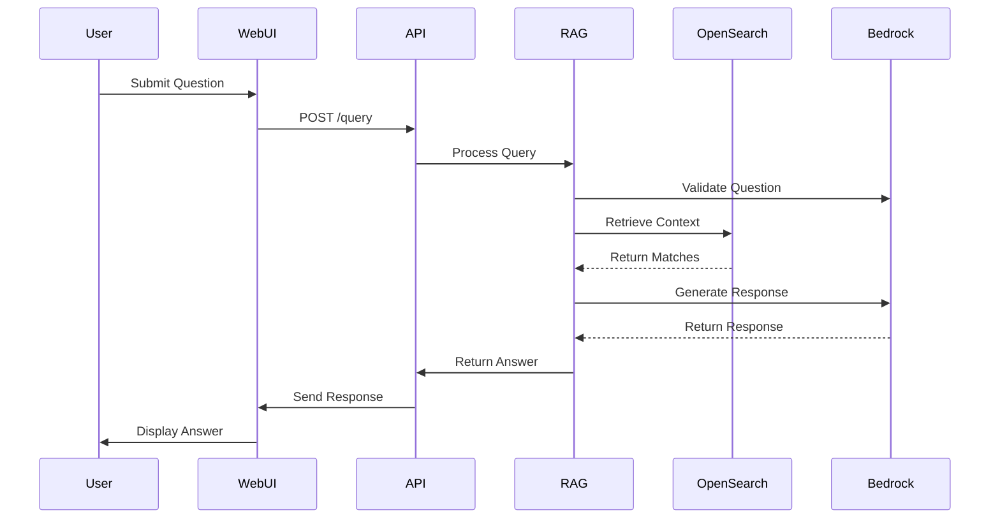

# HR RAG POC Architecture

## System Overview

This document details the architecture of the HR RAG POC system.

## Components

### Data Pipeline
- S3 bucket for HR JSON data storage
- Lambda function for data processing
- OpenSearch for hybrid search capabilities

### RAG Implementation
- LangChain framework for RAG pipeline
- Bedrock for LLM operations
- Entity recognition system
- Response validation

### Web Interface
- React frontend with AWS Amplify
- API Gateway for endpoints
- Cognito for authentication

### Evaluation System
- RAGAS-based evaluation
- Automated testing pipeline
- Performance monitoring

## Data Flow

